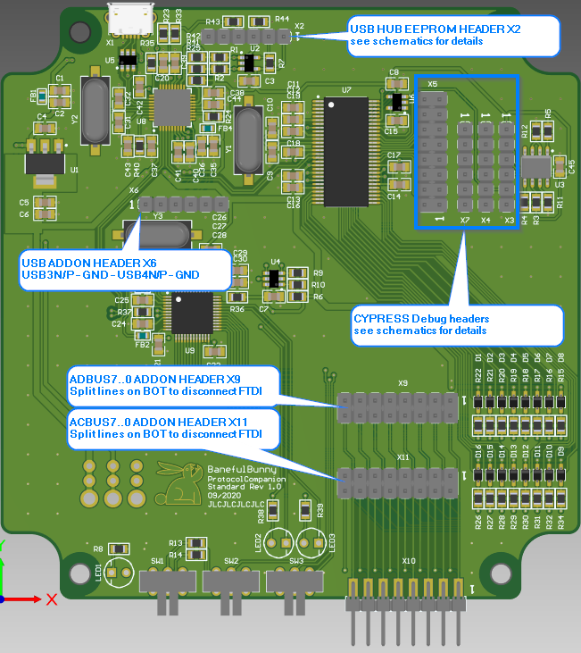
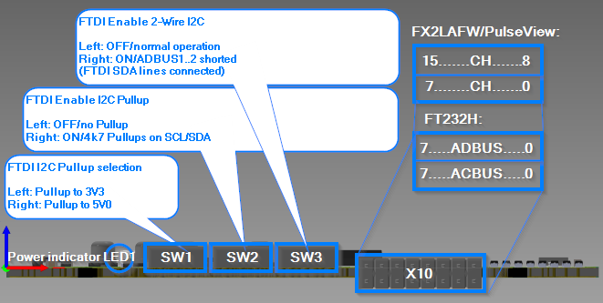

[Back to index](./index.md)

# Usage

- [UI elements description](#ui-elements-description)
- [Using Sigrok Pulseview](#using-sigrok-pulseview)
- [Using PyFTDI](#using-pyftdi)
- [Using OpenOCD](#using-openocd)

## UI elements description

### Top view

- X2: USB HUB EEPROM HEADER
  1. 3V3
  1. WP (10k pullup to 3V3, pull low to release write protect)
  1. I2C SCL (4k7 pullup to 3V3)
  1. I2C SDA (4k7 pullup to 3V3)
  1. USB HUB reset (active low)
  1. GND

- X6: USB ADDON HEADER
  1. USB3_D_N
  1. USB3_D_P
  1. GND
  1. USB4_D_N
  1. USB4_D_P
  1. GND

- X9: FTDI ADBUS ADDON HEADER
  - Pin1..2: ADBUS0
  - ...
  - Pin15..26: ADBUS7
  - Split wires on BOT to disconnect FTDI from outside world

- X11: FTDI ACBUS ADDON HEADER
  - Pin1..2: ACBUS0
  - ...
  - Pin15..26: ACBUS7
  - Split wires on BOT to disconnect FTDI from outside world

### Front view

- LED1: Power indicator LED
- SW1: FTDI I2C Pullup voltage selector
  - LEFT: 3V3
  - RIGHT: 5V0
- SW2: FTDI Enable I2C Pullup resistors
  - LEFT: OFF / No Pullups
  - RIGHT: ON / 4k7 Pullups on SDA/SCL lines
- SW3: FTDI Enable 2-wire I2C interface
  - LEFT: OFF / normal operation
  - RIGHT: ON / ADBUS1..2 shorted (Two SDA lines on FTDI connected)
- X10: FTDI/Probe connector
  - TOP (left to right): FTDI ADBUS7..0 / FX2LAFW (Pulseview) CH15..8
  - BOT (left to right): FTDI ACBUS7..0 / FX2LAFW (Pulseview) CH7..0

## Using Sigrok Pulseview

TBD

## Using PyFTDI

[PyFTDI documentation](https://eblot.github.io/pyftdi/)

## Using JTAG

To be able to use JTAG, it is currently needed to switch the drivers back to
original FTDI drivers using FTDI driver installer. After this, the device can 
be selected as FTDI-based JTAG device e.g. in TopJTAG Probe. 